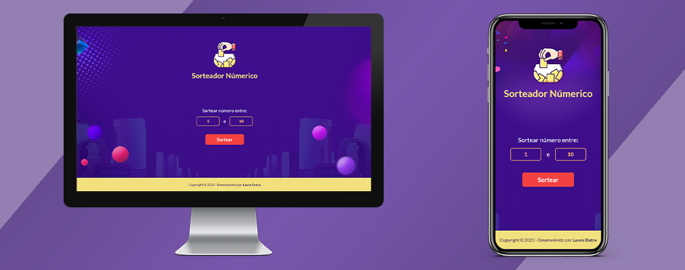

<h1>SORTEADOR</h1>

## 📝 Sobre

O projeto Sorteador permite realizar um sorteio rápido entre dois números, apresentando um resultado instantâneo que inclui a marcação de data e hora do sorteio. O design do site foi planejado tanto para dispositivos móveis quanto para desktops, apresentando uma combinação de cores agradável aos olhos do usuário.

## ⚙ Funcionalidades

Para realizar o sorteio, devem ser digitados dois números em seus respectivos campos. O segundo número deve ser maior e diferente do primeiro, e este deve ser maior que 0. Clique em "Sortear" ou tecle Enter para exibir o resultado, contendo o número sorteado e a informação de data e horário de realização do sorteio. O card do resultado traz ainda dois novos botões; o botão "Repetir" relizará um novo sorteio e o exibirá no card, e o botão "Sair" levará o usuário de volta a página inicial para escolher números diferentes e realizar outro sorteio.

## 🤝🏻 Agradecimentos

Agradeço ao <a href="https://www.github.com/rodolfomori">Rodolfo Mori</a> pela disponibilazação do projeto original na plataforma do DevClub e pelo incentivo para a criação de um novo design e implementação de outras funcionalidades. 

## 🖥 Tecnologias

Este projeto foi desenvolvido com HTML, CSS e JavaScript.
